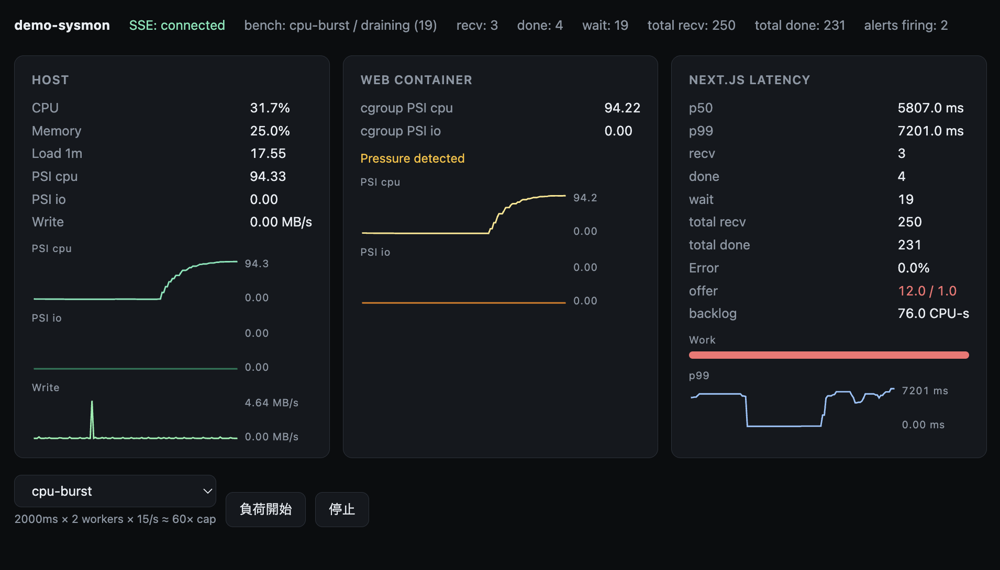

# demo-sysmon



Linux上のWebアプリに負荷をかけたとき、**PSI**（リソースstall）と**p99**（応答遅延）がどう連動するかを、再現・可視化するデモです。

**PSI**（**P**ressure **S**tall **I**nformation）はLinuxカーネルが提供する指標で、タスクがCPU・メモリ・I/Oを待って進めない時間の割合を表します。SNMPやnode_exporterは使わず、`/proc`とcgroupを自前で読みます。

よくある状況 — 「マシン全体は余裕なのに、あるサービスだけ遅い」— を、webコンテナのCPU上限（`cpus: 1.0`）で意図的に再現します。ホストOS側のload averageだけでは見えにくいstallを早く捉え、インフラ指標とアプリ指標を同じタイムラインで見られます。

## 技術スタック

| 層 | 技術 |
|----|------|
| メトリクス収集（`sysmon`） | Go 1.22+、`/proc` / cgroup v2 / PSI |
| ダッシュボード + 負荷対象（`web`） | Next.js 15、TypeScript、Node 22、CSS |
| 負荷シナリオ（`loadgen`） | Python 3.12、＊標準ライブラリのみ |
| 配布 | GitHub（ソース。`sysmon`はホストでgo build） |
| 動作確認環境 | Ubuntu 24.04.4 LTS、Docker Compose（web: `cpus=1.0`, `mem=512m`） |

## 構成


- `sysmon`: ホスト上で動作。`/proc`とcgroupを読む
- `web`: 画面表示・負荷対象・レスポンス計測用コンテナ。CPUリソースを1コアに制限し、サービス単位の飽和を再現
- ブラウザ: `sysmon`へSSE接続してメトリクスを取得
- `loadgen`: HTTPロードジェネレーター用コンテナ

## ダッシュボードの3パネル

| パネル | 表示内容 | 高いときの意味 |
|--------|----------|----------------|
| **Host** | マシン全体のCPU・メモリ・Load・**PSI cpu / PSI io** | ホスト全体に余裕がない、または他プロセスも巻き込み。io-burstでは**PSI io**が主指標 |
| **Web container** | このサービスのcgroup PSI cpu / io | CPU上限への到達（cpu）、またはこのプロセスもI/O待ち（io） |
| **Next.js latency** | HTTP応答時間のp50/p99、recv/done/wait、offer/backlog、エラー率 | ユーザーから見て応答が遅い・不安定 |

メインシナリオ（ramp / cpu-burst）で顕著に確認できる相関は、**cgroup PSI cpuが先に上がり、そのあとp99が悪化する**ことです。CPUだけコンテナ上限（`cpus: 1.0`）があるので、「ホストは余裕、そのサービスだけ遅い」が再現できます。io-burstは対比で、**Host PSI io**が先に動きます。

## 用語

**PSI**（**P**ressure **S**tall **I**nformation）は、Linuxカーネルが提供する指標で、タスクがCPU・メモリ・I/Oを待って進めない時間の割合を表します。詳細は[公式ドキュメント](https://docs.kernel.org/accounting/psi.html)を参照してください。

| 用語 | 意味 | 高いときの見立て |
|------|------|------------------|
| **PSI cpu / PSI io** | 直近10秒のstall割合（ホスト） | リソース不足で処理が待たされている。load averageより早く立ち上がることがある |
| **p50** | 指標：半分のリクエストがこれ以下 | 全体の「いつもの速さ」。p50も悪い = 全体が遅い |
| **p99** | 遅い側の1% | 尻尾（テール）側のレスポンス速度。**p99だけ跳ねる** = 一部だけ待たされている（飽和の典型） |
| **recv** | 直近1秒の受信リクエスト件数 | Next.jsへルーティングされたリクエスト数。詰まっていても上昇する |
| **done** | 直近1秒に完了した受信リクエスト件数 | リクエストを処理した件数。詰まり始めるrecvより下がる |
| **wait** | 受けたがまだ終わっていない件数 | 処理待ち件数。cpu-burstでは溜まりやすい |
| **total recv** | 受信した負荷リクエスト合計 | 処理が完了して wait が空になるとリセットされる |
| **total done** | 処理済み負荷リクエスト合計 | 同上 |
| **offer** | 直近1秒に受けたCPUワークロード（CPU秒/秒） | cap（1.0）を超えると待ち行列となる。cpu-burstは数十倍 |
| **cap** | webコンテナのCPU枠 | 本デモの上限値(Default=1.0) |
| **backlog** | まだ完了していないCPUワークロード（CPU秒） | 行列待ちのにワークロード。drainingが完了するまで残る |
| **cgroup PSI cpu / io** | コンテナ単位の待ち（同上PSI） | cpu: サービス単位の割当てCPU上限の指標 / io: 処理を行うプロセスのI/O待ち状況 |

## 負荷シナリオ

ダッシュボードの**負荷開始**、または`./kickstart.sh bench <scenario>`で実行します。CLI実行時は`out/correlation.csv`を出力します。

### ramp

| フェーズ | 内容 | 時間（秒） |
|----------|------|------------|
| warmup | `/api/load/work?ms=30` @ 10 RPS | 20 |
| work-ramp | `/api/load/work?ms=50` @ 30 RPS | 40 |
| cpu-ramp | `/api/load/cpu?ms=500` @ 20 RPS | 40 |
| cooldown | `/api/load/work?ms=20` @ 5 RPS | 20 |

段階的に負荷が上がるため、**cgroup PSI cpu → p99**の相関が観察しやすくなります。

### cpu-burst

| フェーズ | 内容 | 時間（秒） |
|----------|------|------------|
| warmup | `/api/load/work?ms=30` @ 10 RPS | 10 |
| burst | `/api/load/cpu?ms=2000` @ 15 RPS | 20 |
| cooldown | `/api/load/work?ms=20` @ 5 RPS | 10 |

短時間でCPUを集中的に使い、**cgroup PSI cpu**とp99が急上昇しやすくなります。（制限はCPU枠`cpus: 1.0`のみ、I/O上限なし）

### io-burst

| フェーズ | 内容 | 時間（秒） |
|----------|------|------------|
| warmup | `/api/load/work?ms=30` @ 10 RPS | 10 |
| burst | `/api/load/io?mb=32` @ 8 RPS | 20 |
| cooldown | `/api/load/work?ms=20` @ 5 RPS | 10 |

同期ディスク書き込み負荷です。コンテナにI/O上限は付けていません。

**確認の目安**: **Host PSI io**が先に上がり、cgroup PSI ioも同じ向き、そのあとp99。CPU PSIはあまり動かない。書き込み先はホストの実ディスク（`./.io`）。

## Quick start

```bash
sudo apt install -y docker.io docker-compose-v2 golang-go
git clone https://github.com/extreajp/demo-sysmon && cd demo-sysmon
./kickstart.sh
```

ローカル実行の場合は、[http://127.0.0.1:3000](http://127.0.0.1:3000)を開きます。
リモート実行の場合は、TCP/3000とTCP/9101をローカルポートフォワードしてください。ブラウザは[http://127.0.0.1:3000](http://127.0.0.1:3000)で開きます。`localhost`はsysmonのCORS（許可は`http://127.0.0.1:3000`のみ）で弾かれます。

## コマンド

| コマンド | 動作 |
|----------|------|
| `./kickstart.sh` | 起動 |
| `./kickstart.sh down` | 停止 |
| `./kickstart.sh status` | PID / compose / snapshot |
| `./kickstart.sh bench ramp` | `out/correlation.csv`を出力 |
| `./kickstart.sh logs sysmon` | ログを表示 |
| `./kickstart.sh purge` | 停止して実行状態を削除 |

## 動作確認

1. ヘッダーが`SSE: connected`になり、Host / Web containerパネルに値が入ること
2. シナリオ（例: **ramp**） → **負荷開始** ボタンを押下
3. 数十秒でcgroup PSI cpuが上がり、p99が悪化する（io-burstならHost PSI ioが先）

ヘッダーの`bench: idle`は、負荷の送信も未完了リクエストも無い状態を示します。送り終えた直後は`draining (N)`（Nは未完了の負荷リクエスト数）となります。

### トラブルシュート

- web(TCP/3000)にアクセスできない → `./kickstart.sh up --build`
- `permission denied`（docker）→ ユーザーを`docker`グループへ（再ログイン）
- `SSE: disconnected` → sysmonが`127.0.0.1:9101`でLISTENしている確認（`./kickstart.sh status`）

## 参考

- [Pressure Stall Information (PSI) — Linux Kernel Documentation](https://docs.kernel.org/accounting/psi.html) — `some` / `full`の意味、`avg10`などメトリクス形式の公式説明
