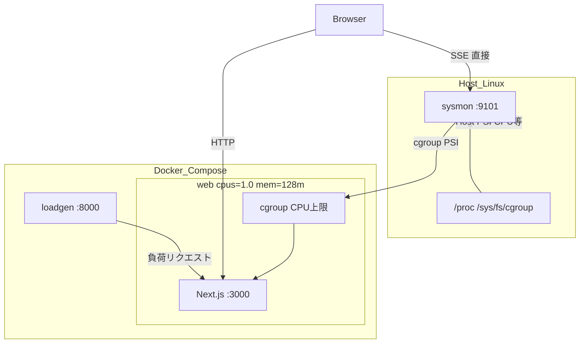

# demo-sysmon

Linux 上の Web アプリに負荷をかけたとき、**PSI**（リソース stall）と **p99**（応答遅延）がどう連動するかを、1 リポジトリで再現・可視化するデモです。

**PSI**（**P**ressure **S**tall **I**nformation）は Linux カーネルが提供する指標で、タスクが CPU・メモリ・I/O を待って進めない時間の割合を表します。SNMP や node_exporter は使いません。`/proc` と cgroup を自前で読みます。

よくある状況 — 「マシン全体は余裕なのに、あるサービスだけ遅い」— を、web コンテナの CPU 上限（`cpus: 1.0`）で意図的に再現します。load average だけでは見えにくい stall を早く捉え、インフラ指標とアプリ指標を同じタイムラインで見られます。

## 技術スタック

| 層 | 技術 |
|----|------|
| メトリクス収集 (`sysmon`) | Go 1.22+、`/proc` / cgroup v2 / PSI |
| ダッシュボード + 負荷対象 (`web`) | Next.js 15、TypeScript、Node 22、CSS Modules |
| 負荷シナリオ (`loadgen`) | Python 3.12、標準ライブラリのみ |
| 配布 | GitHub（ソース + `sysmon` バイナリ Release） |
| 実行確認 | Ubuntu 24.04.4 LTS、Docker Compose（web: `cpus=1.0`, `mem=128m`） |

## 構成



- `sysmon` はホスト上で動き、`/proc` と cgroup を読む
- `web` はコンテナ内。CPU を 1 コアに制限し、サービス単位の飽和を再現する
- ブラウザはメトリクスを `sysmon` に直接 SSE 接続する（プロキシなし）
- `loadgen` が HTTP で `web` に負荷をかける

## ダッシュボードの 3 パネル

画面のラベルは英語のままです。

| パネル | 何を見ているか | 高い・悪化すると |
|--------|----------------|------------------|
| **Host** | マシン全体の CPU・メモリ・Load・PSI | ホスト全体に余裕がない、または他プロセスも巻き込んでいる |
| **Web container** | このサービスに割り当てた CPU 枠への stall（cgroup PSI） | コンテナの CPU 上限に当たり、処理が CPU 待ちになっている |
| **Next.js latency** | HTTP 応答時間の p50/p99、RPS、エラー率 | ユーザーから見て応答が遅い・不安定になっている |

デモで見せたい相関は、**cgroup PSI が先に上がり、そのあと p99 が悪化する**ことです。リソースの stall が、アプリの体感速度に効いています。

## 用語

**PSI**（**P**ressure **S**tall **I**nformation）は、Linux カーネルが提供する指標で、タスクが CPU・メモリ・I/O を待って進めない時間の割合を表します。詳細は [公式ドキュメント](https://docs.kernel.org/accounting/psi.html) を参照してください。

| 用語 | 意味 | 高いと何が考えられるか |
|------|------|------------------------|
| **PSI avg10** | 直近 10 秒の stall 割合 | リソース不足で処理が待たされている。load average より早く立ち上がることがある |
| **p50 / p99** | 応答時間の中央値 / 上位 1% | p99 が跳ねる = 一部のリクエストが極端に遅い（飽和・スロットリングの典型） |
| **RPS** | 秒あたりリクエスト数 | 負荷の強さの目安 |
| **cgroup PSI** | コンテナに割り当てた CPU 枠に対する待ち（同上 PSI、cgroup 単位） | そのサービスの CPU 上限に当たっている |

## 負荷シナリオ

ダッシュボードの **負荷開始**、または `./kickstart.sh bench <scenario>` で実行します。CLI 実行時は `out/correlation.csv` を出力します。

### ramp（推奨・初回向け）

| フェーズ | 内容 | 秒 |
|----------|------|-----|
| warmup | `/api/load/work?ms=30` @ 10 RPS | 20 |
| work-ramp | `/api/load/work?ms=50` @ 30 RPS | 40 |
| cpu-ramp | `/api/load/cpu?ms=500` @ 20 RPS | 40 |
| cooldown | `/api/load/work?ms=20` @ 5 RPS | 20 |

段階的に負荷が上がるため、**cgroup PSI → p99** の相関が観察しやすいです。

### cpu-burst

| フェーズ | 内容 | 秒 |
|----------|------|-----|
| warmup | `/api/load/work` @ 10 RPS | 10 |
| burst | `/api/load/cpu?ms=2000` @ 15 RPS | 20 |
| cooldown | `/api/load/work` @ 5 RPS | 10 |

短時間で CPU を集中的に使います。PSI と p99 が急上昇しやすいです。web コンテナは **mem_limit: 128m** のため、OOM の可能性があります。

### io-burst

| フェーズ | 内容 | 秒 |
|----------|------|-----|
| warmup | `/api/load/work` @ 10 RPS | 10 |
| burst | `/api/load/io?mb=32` @ 8 RPS | 20 |
| cooldown | `/api/load/work` @ 5 RPS | 10 |

同期ディスク書き込み負荷です。CPU より **I/O stall** 寄りの挙動を観察できます。

## Quick start

```bash
sudo apt install -y docker.io docker-compose-v2 golang-go
git clone https://github.com/extreajp/demo-sysmon && cd demo-sysmon
./kickstart.sh
```

[http://127.0.0.1:3000](http://127.0.0.1:3000) を開きます。Linux + Docker 専用です。

## コマンド

| | |
|---|---|
| `./kickstart.sh` | 起動 |
| `./kickstart.sh down` | 停止 |
| `./kickstart.sh status` | PID / compose / snapshot |
| `./kickstart.sh bench ramp` | `out/correlation.csv` を出力 |
| `./kickstart.sh logs sysmon` | ログを表示 |
| `./kickstart.sh purge` | 停止して実行状態を削除 |

## 検証

1. ヘッダーが `SSE: connected` になり、Host / Web container パネルに値が入る
2. シナリオ **ramp** → **負荷開始**
3. 数十秒で cgroup PSI が上がり、p99 が悪化する

ローカルデモ専用です。インターネットに公開しないでください。

トラブルシュート:

- web が出ない → `./kickstart.sh up --build`
- `permission denied`（docker）→ ユーザーを `docker` グループへ（再ログイン）
- `SSE: disconnected` → sysmon が `127.0.0.1:9101` で動いているか（`./kickstart.sh status`）

## 参考

- [Pressure Stall Information (PSI) — Linux Kernel Documentation](https://docs.kernel.org/accounting/psi.html) — `some` / `full` の意味、`avg10` などメトリクス形式の公式説明
